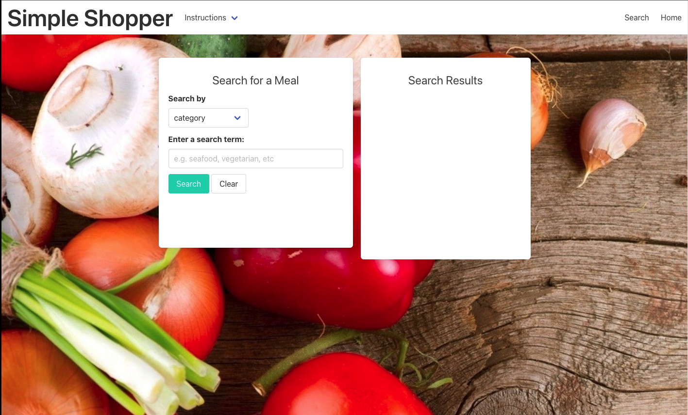

# Simple-Shopper

## Functionality
This application provides users the ability to search for meals based on different search criteria. Upon searching, users will have the option to add search result meals to their My Meals list. This will autogenerate a grocery list for them based on the ingredients needed for My Meals.

## Website
https://sidhelore.github.io/Simple-Shopper/

## Built With
* HTML
* CSS
* Javascript
* TheMealDB API
* Zestful API
* Bulma CSS Framework
* Font Awesome icons

## Contributor(s)
* Lakelon Bailey
* Jessica Hoffman

## Template

### Est. June 2022
